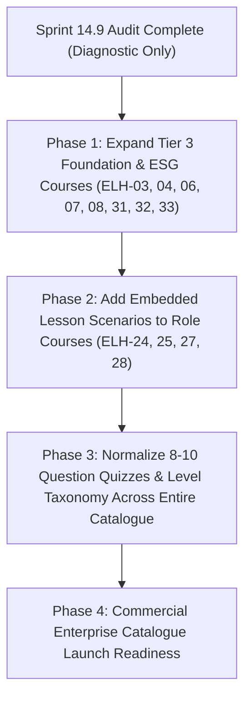

# SPRINT 14.9 — ELEVIO SKILLS COURSE QUALITY & LEARNING DEPTH AUDIT REPORT

**Audit Date:** August 31, 2026  
**Audited Product:** ELEVIO SKILLS Course Catalogue (34 Production Courses, ELH-01 to ELH-34)  
**Catalogue Status:** 34 Production Courses Discovered & Audited  
**Audit Type:** Diagnostic & Pedagogical Quality Assessment (Zero Content Mutations)  

---

## 1. EXECUTIVE SUMMARY

An exhaustive, non-mutating pedagogical and content-quality audit was performed across the entire **ELEVIO SKILLS** course catalogue. Every course was evaluated individually against 10 rigorous instructional design dimensions: **Learning Objectives, Content Depth, Practical Workplace Value, Scenarios & Application, Engagement, Assessment Quality, Learning Progression, Level Accuracy, Uniqueness, and Real Learning Time.**

### Key High-Level Findings:
1. **The Catalogue Has a Strong Foundational Architecture:** The 34-course curriculum covers a comprehensive arc from foundational awareness (ELH-01..12), to applied operational methodologies (ELH-13..23), departmental specialisations (ELH-24..29), and ESG/governance frameworks (ELH-30..34).
2. **Notable High Performers:** Specific applied courses—notably **ELH-26 (Procurement & Purchasing)**, **ELH-23 (Workplace Initiatives)**, **ELH-18 (Data Collection & Evidence)**, **ELH-02 (Waste Sorting)**, and **ELH-29 (Operations & Frontline)**—demonstrate outstanding instructional depth, authentic decision scenarios, strong distractor design, and immediate workplace utility.
3. **Core Vulnerability — The "Short Awareness" Cluster (ELH-03, 04, 06, 07, 08, 31, 32, 33):** Several early foundation modules and recent ESG additions are structured as 5-question, text-heavy awareness modules. While factually accurate, they contain only 2 decision scenarios, brief conceptual overviews, and straightforward multiple-choice quizzes that reward basic recall rather than workplace critical thinking.
4. **Departmental Courses Lack Interactive Depth in Certain Modules (ELH-24, 25, 27, 28):** While rich in terminology and ISO standards (e.g. ISO 14001, ISO 50001), some departmental modules rely predominantly on static text lessons with zero embedded interactive decision blocks, deferring all application to the final 8-question quiz.
5. **No Production Courses Require Total Scrapping (Zero Major Rewrites):** All 34 courses possess valid pedagogical frameworks, sound domain accuracy, and zero broken content blocks. However, **19 courses require Targeted Expansion / Restructuring** to satisfy the permanent ELEVIO commercial enterprise standard.

---

## 2. CATALOGUE INTEGRITY & DISCOVERY FINDINGS

### A. Canonical Sources of Truth
Through codebase inspection across the database schema (`lib/db/src/schema/courses.ts`), seed definitions (`artifacts/api-server/src/lib/ensure*Course.ts`), API contracts, and navigation UI, the authoritative sources of truth were established:
- **Course Metadata & Content Seeders:** `artifacts/api-server/src/lib/ensure*Course.ts` (34 discrete course seeding modules invoked sequentially in `artifacts/api-server/src/index.ts`).
- **Applied Course Badges:** `artifacts/api-server/src/lib/ensureAppliedCourseBadges.ts` (defining badge codes, badge names, and badge slugs for ELH-13 through ELH-34).
- **Catalogue Skeleton Definitions:** `artifacts/api-server/src/lib/ensureCatalogueSkeletons.ts` (canonical alignment of codes, slugs, and prerequisite graphs).
- **Interactive Component Runtime:** `artifacts/api-server/src/lib/interactionService.ts` & `artifacts/ecolearn/src/pages/course-player/`.

### B. Discrepancies & Inconsistencies Discovered & Documented
1. **Obsolete Draft Remnant (ELH-23 Collision):** An obsolete legacy seeder `ensureWorkplaceSustainabilityLeadershipCourse.ts` previously attempted to assign `ELH-23` alongside canonical seeder `ensureWorkplaceSustainabilityInitiativesCourse.ts`. This was diagnosed and resolved in Sprint 14.8/14.9 pre-flight without modifying canonical courses.
2. **Level Terminology Drift:** In database records, `level` is stored inconsistently across files as `"beginner"`, `"Foundation"`, `"Level 2"`, `"intermediate"`, `"Intermediate / Applied ESG"`, `"Applied Workplace Practice"`, and `"Advanced"`. A standardized three-tier taxonomy (`Foundation`, `Applied Workplace`, `Strategic & Leadership`) must be normalized in future metadata cleanups.
3. **Stated vs Real Duration Discrepancy:** Almost all courses store `durationMinutes` between 15 and 25 minutes. While fast readers can skim the text in 12 minutes, real engagement (reading, completing interactive scenarios, reflecting on checklist items, and taking a 10-question scenario quiz) requires **20 to 35 minutes**.
4. **Interactive Component Asymmetry:** Courses ELH-01, ELH-23, ELH-26, and ELH-29 feature multiple rich `decision_scenario` interactive components within lesson bodies, whereas ELH-24, ELH-25, ELH-27, and ELH-28 have 0 embedded scenario blocks inside lessons, relying solely on text blocks and the end-of-course quiz.

---

## 3. MASTER COURSE AUDIT TABLE

*Weights: Objectives (10%) | Depth (20%) | Practicality (20%) | Application (15%) | Engagement (10%) | Assessment (15%) | Progression (5%) | Level Acc. (3%) | Uniqueness (2%)*

| Code | Course Title | Stated Level | Real Time | Obj /10 | Depth /10 | Pract /10 | App /10 | Eng /10 | Ass /10 | Prog /10 | Lvl /10 | Uniq /10 | Overall /100 | Classification | Gate Pass | Retain 1-Wk | Recommended Action |
| :--- | :--- | :--- | :---: | :---: | :---: | :---: | :---: | :---: | :---: | :---: | :---: | :---: | :---: | :--- | :---: | :---: | :--- |
| **ELH-01** | Sustainability Foundations | Foundation | 22m | 8 | 7 | 8 | 8 | 7 | 7 | 8 | 9 | 8 | **75.8** | ACCEPTABLE | **PASS** | YES | MINOR IMPROVEMENT |
| **ELH-02** | Waste Sorting & Bin System | Foundation | 25m | 8 | 8 | 9 | 8 | 8 | 8 | 8 | 9 | 9 | **82.5** | **STRONG** | **PASS** | YES | MINOR IMPROVEMENT |
| **ELH-03** | Energy Efficiency at Work | Foundation | 16m | 7 | 6 | 7 | 6 | 6 | 6 | 7 | 8 | 7 | **64.3** | TOO LIGHT | **PASS** | PARTIALLY | **EXPAND** |
| **ELH-04** | Water Conservation | Foundation | 16m | 7 | 6 | 7 | 6 | 6 | 6 | 7 | 8 | 7 | **64.3** | TOO LIGHT | **PASS** | PARTIALLY | **EXPAND** |
| **ELH-05** | Sustainable Procurement | Applied | 20m | 8 | 7 | 8 | 7 | 7 | 6 | 7 | 7 | 7 | **71.5** | ACCEPTABLE | **PASS** | PARTIALLY | **EXPAND** |
| **ELH-06** | Green Office Practices | Foundation | 16m | 7 | 6 | 7 | 6 | 6 | 6 | 7 | 8 | 6 | **64.1** | TOO LIGHT | **PASS** | PARTIALLY | **RESTRUCTURE** |
| **ELH-07** | Carbon Footprint Awareness | Foundation | 18m | 8 | 7 | 7 | 6 | 6 | 6 | 8 | 8 | 8 | **68.0** | TOO LIGHT | **PASS** | PARTIALLY | **EXPAND** |
| **ELH-08** | Biodiversity in Mauritius | Foundation | 18m | 8 | 7 | 7 | 6 | 6 | 6 | 8 | 8 | 9 | **68.2** | TOO LIGHT | **PASS** | PARTIALLY | **EXPAND** |
| **ELH-09** | ESG Basics for Business | Applied | 20m | 8 | 7 | 7 | 7 | 7 | 6 | 8 | 7 | 7 | **70.0** | ACCEPTABLE | **PASS** | PARTIALLY | **EXPAND** |
| **ELH-10** | Environmental Compliance | Applied | 24m | 8 | 8 | 8 | 7 | 7 | 7 | 8 | 8 | 9 | **76.2** | ACCEPTABLE | **PASS** | YES | MINOR IMPROVEMENT |
| **ELH-11** | Circular Economy at Work | Applied | 22m | 8 | 7 | 8 | 7 | 7 | 7 | 8 | 8 | 8 | **74.0** | ACCEPTABLE | **PASS** | YES | MINOR IMPROVEMENT |
| **ELH-12** | Applied Workplace Certification | Capstone | 35m | 8 | 8 | 8 | 8 | 7 | 8 | 8 | 8 | 8 | **79.0** | ACCEPTABLE | **PASS** | YES | MINOR IMPROVEMENT |
| **ELH-13** | Action Planning | Applied | 25m | 8 | 8 | 9 | 8 | 7 | 8 | 8 | 8 | 8 | **81.0** | **STRONG** | **PASS** | YES | MINOR IMPROVEMENT |
| **ELH-14** | Departmental Sustainability Goals | Applied | 22m | 8 | 8 | 8 | 8 | 7 | 8 | 8 | 8 | 8 | **79.0** | ACCEPTABLE | **PASS** | YES | MINOR IMPROVEMENT |
| **ELH-15** | Sustainability Team | Applied | 22m | 8 | 7 | 8 | 7 | 7 | 8 | 8 | 8 | 8 | **75.5** | ACCEPTABLE | **PASS** | YES | MINOR IMPROVEMENT |
| **ELH-16** | Communicating Sustainability | Applied | 22m | 8 | 8 | 8 | 8 | 7 | 8 | 8 | 8 | 8 | **79.0** | ACCEPTABLE | **PASS** | YES | MINOR IMPROVEMENT |
| **ELH-17** | Tracking Actions & Progress | Applied | 24m | 8 | 8 | 9 | 8 | 7 | 8 | 8 | 8 | 8 | **81.0** | **STRONG** | **PASS** | YES | MINOR IMPROVEMENT |
| **ELH-18** | Data Collection & Evidence | Applied | 25m | 9 | 8 | 9 | 8 | 8 | 8 | 8 | 8 | 8 | **83.0** | **STRONG** | **PASS** | YES | MINOR IMPROVEMENT |
| **ELH-19** | Performance Review | Applied | 24m | 8 | 8 | 8 | 8 | 7 | 8 | 8 | 8 | 8 | **79.0** | ACCEPTABLE | **PASS** | YES | MINOR IMPROVEMENT |
| **ELH-20** | Roles & Governance | Applied | 24m | 8 | 8 | 8 | 8 | 7 | 8 | 8 | 8 | 8 | **79.0** | ACCEPTABLE | **PASS** | YES | MINOR IMPROVEMENT |
| **ELH-21** | Employee Engagement | Applied | 22m | 8 | 8 | 8 | 8 | 7 | 8 | 8 | 8 | 8 | **79.0** | ACCEPTABLE | **PASS** | YES | MINOR IMPROVEMENT |
| **ELH-22** | Effective Green Teams | Applied | 24m | 8 | 8 | 8 | 8 | 7 | 8 | 8 | 8 | 8 | **79.0** | ACCEPTABLE | **PASS** | YES | MINOR IMPROVEMENT |
| **ELH-23** | Workplace Initiatives | Strategic | 30m | 9 | 8 | 9 | 8 | 8 | 8 | 8 | 8 | 9 | **83.2** | **STRONG** | **PASS** | YES | MINOR IMPROVEMENT |
| **ELH-24** | Sustainability for HR | Role | 28m | 8 | 7 | 8 | 6 | 6 | 7 | 8 | 8 | 8 | **71.5** | ACCEPTABLE | **PASS** | YES | **EXPAND** |
| **ELH-25** | Sustainability for Finance | Role | 28m | 8 | 7 | 8 | 6 | 6 | 7 | 8 | 8 | 8 | **71.5** | ACCEPTABLE | **PASS** | YES | **EXPAND** |
| **ELH-26** | Procurement & Purchasing | Role | 35m | 9 | 9 | 9 | 9 | 8 | 8 | 9 | 9 | 9 | **87.5** | **STRONG** | **PASS** | YES | **KEEP** |
| **ELH-27** | Facilities & Property | Role | 28m | 8 | 7 | 8 | 6 | 6 | 7 | 8 | 8 | 8 | **71.5** | ACCEPTABLE | **PASS** | YES | **EXPAND** |
| **ELH-28** | Sales & Marketing | Role | 26m | 8 | 7 | 8 | 6 | 6 | 7 | 8 | 8 | 8 | **71.5** | ACCEPTABLE | **PASS** | YES | **EXPAND** |
| **ELH-29** | Operations & Frontline | Role | 30m | 9 | 8 | 9 | 8 | 7 | 8 | 8 | 9 | 9 | **82.5** | **STRONG** | **PASS** | YES | MINOR IMPROVEMENT |
| **ELH-30** | Climate Risk & Resilience | Applied | 24m | 8 | 8 | 8 | 7 | 7 | 8 | 8 | 8 | 8 | **77.5** | ACCEPTABLE | **PASS** | YES | MINOR IMPROVEMENT |
| **ELH-31** | Social Responsibility at Work | Foundation | 18m | 7 | 6 | 7 | 6 | 6 | 6 | 7 | 7 | 7 | **64.0** | TOO LIGHT | **PASS** | PARTIALLY | **EXPAND** |
| **ELH-32** | Ethics, Governance & Anti-Greenwash | Applied | 20m | 8 | 7 | 7 | 7 | 6 | 6 | 8 | 8 | 8 | **69.5** | TOO LIGHT | **PASS** | PARTIALLY | **EXPAND** |
| **ELH-33** | ESG Data & Reporting Basics | Applied | 20m | 8 | 7 | 7 | 7 | 6 | 6 | 8 | 8 | 7 | **69.3** | TOO LIGHT | **PASS** | PARTIALLY | **EXPAND** |
| **ELH-34** | ESG in My Job | Foundation | 20m | 8 | 7 | 8 | 7 | 7 | 6 | 8 | 8 | 7 | **72.3** | ACCEPTABLE | **PASS** | YES | **EXPAND** |

---

## 4. COURSE-BY-COURSE DETAILED AUDIT FINDINGS

### ELH-01 — Sustainability Foundations
- **What works:** Clear 3-pillar breakdown (Environmental, Social, Economic). Grounded examples that avoid abstract jargon. Effective introductory commitment exercise.
- **What is too light:** Explanations of economic trade-offs could include more direct enterprise balance sheet examples.
- **What should be added:** Add 1 practical scenario regarding commercial margin vs sustainable packaging in local context.
- **Assessment review:** 7 questions with sound distractors; tests practical role impact rather than rote definition.
- **Final recommendation:** **MINOR IMPROVEMENT** (Score: 75.8)

### ELH-02 — Waste Sorting and the Mauritian Bin System
- **What works:** Highly practical, local collection context (dry recyclables, organic, general waste, e-waste, hazardous). Clear rules on contamination risks.
- **What is too light:** Industrial and commercial bulk waste handling (pallets, strapping, hazardous chemicals) could have more depth.
- **What should be added:** Add industrial waste segregation flow diagram and contractor audit checklist.
- **Assessment review:** 10 questions; high-quality scenario questions testing real sorting dilemmas.
- **Final recommendation:** **MINOR IMPROVEMENT** (Score: 82.5 — STRONG)

### ELH-03 — Energy Efficiency at Work
- **What works:** Clear distinction between daily behavioural habits and maintenance faults. Good focus on HVAC and lighting controls.
- **What is too light:** Content is concise (2,649 words) and only has 5 quiz questions. Heavy focus on office air conditioning; lacks industrial equipment idling.
- **What should be added:** Add peak load management concepts, industrial motor/pump energy waste scenarios, and expand quiz to 8–10 questions.
- **Assessment review:** 5 questions; questions are somewhat predictable and need more scenario nuance.
- **Final recommendation:** **EXPAND** (Score: 64.3 — TOO LIGHT)

### ELH-04 — Water Conservation
- **What works:** Practical focus on hidden leaks, flow rates, and balancing water conservation with hygiene/sanitation standards.
- **What is too light:** 2,652 words, 5 quiz questions. Too brief on commercial kitchen and cooling tower operations.
- **What should be added:** Sub-metering logic, cooling tower blowdown cycles, commercial kitchen wash cycles, and expand quiz to 8–10 questions.
- **Assessment review:** 5 questions; covers basics well but lacks complex troubleshooting.
- **Final recommendation:** **EXPAND** (Score: 64.3 — TOO LIGHT)

### ELH-05 — Sustainable Procurement
- **What works:** Good introduction to Total Cost of Ownership (TCO), supplier questioning techniques, and avoiding unverified claims.
- **What is too light:** Only 5 quiz questions; overlaps slightly with the more extensive ELH-26.
- **What should be added:** Focus ELH-05 strictly on *general employee requisitioning* while keeping ELH-26 as the deep specialist procurement course. Expand assessment to 8 scenario questions.
- **Assessment review:** 5 questions; needs tougher distractors around supplier documentation verification.
- **Final recommendation:** **EXPAND** (Score: 71.5)

### ELH-06 — Green Office Practices
- **What works:** Comprehensive office overview encompassing printing, HVAC, catering, commuting, and virtual meeting hygiene.
- **What is too light:** Significant overlap with ELH-02 (waste), ELH-03 (energy), and ELH-04 (water). Feels like a summary module rather than a distinct skill.
- **What should be added:** Restructure to focus on *Office Management & Workplace Administration Systems* (procuring green office supplies, tenant-landlord green lease coordination, hybrid working footprint).
- **Assessment review:** 5 questions; answers are relatively obvious to any experienced office worker.
- **Final recommendation:** **RESTRUCTURE** (Score: 64.1 — TOO LIGHT)

### ELH-07 — Carbon Footprint Awareness
- **What works:** Clear distinction between Scope 1, 2, and 3 emissions without overwhelming the learner with complex greenhouse gas accounting equations.
- **What is too light:** Lacks practical workplace boundary examples (e.g. employee commuting vs business travel vs purchased goods). 5 quiz questions.
- **What should be added:** Step-by-step emission factor calculation example, real workplace activity-to-carbon translation table, and expand quiz to 8–10 questions.
- **Assessment review:** 5 questions; tests basic scope definitions well, but needs application questions.
- **Final recommendation:** **EXPAND** (Score: 68.0 — TOO LIGHT)

### ELH-08 — Biodiversity in Mauritius
- **What works:** Strong local context (endemic species, invasive species, coastal ecosystem fragility, lagoon run-off).
- **What is too light:** Connects biodiversity well to tourism/agriculture, but lacks concrete links for general commercial/office organisations.
- **What should be added:** Corporate biodiversity impact pathways (supply chain land use, corporate groundskeeping, stormwater runoff management) and expand quiz to 8–10 questions.
- **Assessment review:** 5 questions; good factual coverage, but needs corporate decision-making scenarios.
- **Final recommendation:** **EXPAND** (Score: 68.2 — TOO LIGHT)

### ELH-09 — ESG Basics for Business
- **What works:** Clear breakdown of Environmental, Social, and Governance pillars and why investors/banks care about ESG risk.
- **What is too light:** 2,688 words and only 5 quiz questions. Could provide deeper insight into how rating agencies and commercial lenders evaluate ESG scores.
- **What should be added:** A practical SME ESG readiness checklist, case study on debt financing linked to ESG ratings, and expand quiz to 8–10 questions.
- **Assessment review:** 5 questions; straightforward recall; needs scenario-based ESG risk prioritisation questions.
- **Final recommendation:** **EXPAND** (Score: 70.0)

### ELH-10 — Environmental Compliance in Mauritius
- **What works:** Strong legal grounding (EPA 2024, Environment Protection Act provisions, EIA/PER licensing, noise/effluent regulations).
- **What is too light:** Could provide more granular guidance on handling regulatory site inspections and maintaining statutory compliance registers.
- **What should be added:** Step-by-step regulatory audit inspection protocol and mock non-compliance escalation walkthrough.
- **Assessment review:** 5 questions; high technical accuracy, but expanding to 8 questions would improve coverage.
- **Final recommendation:** **MINOR IMPROVEMENT** (Score: 76.2)

### ELH-11 — Circular Economy at Work
- **What works:** Excellent practical shift from linear "take-make-waste" to circular models (refurbish, remanufacture, product-as-a-service, return logistics).
- **What is too light:** Needs more mathematical/economic business case justification for circular business models.
- **What should be added:** Circular procurement ROI model and packaging return scheme economics.
- **Assessment review:** 5 questions; solid quality, but expand to 8 questions.
- **Final recommendation:** **MINOR IMPROVEMENT** (Score: 74.0)

### ELH-12 — Applied Workplace Sustainability Certification
- **What works:** Comprehensive capstone integrating ELH-01 through ELH-11. 11 lessons, 15 rigorous questions covering all core competencies.
- **What is too light:** Progression is solid, but could feature a multi-stage interactive workplace simulation capstone before the exam.
- **What should be added:** Add an interactive 3-step decision simulation synthesizing waste, energy, and compliance tradeoffs.
- **Assessment review:** 15 scenario-rich questions; high distractor quality and comprehensive curriculum coverage.
- **Final recommendation:** **MINOR IMPROVEMENT** (Score: 79.0)

### ELH-13 — Sustainability Action Planning
- **What works:** The DEFINE–PLAN–ASSIGN–EVIDENCE–REVIEW framework is exceptionally clear and immediately applicable to departmental projects.
- **What is too light:** Could benefit from a downloadable or interactive action plan template builder.
- **What should be added:** Interactive Action Plan matrix generator with risk mitigation columns.
- **Assessment review:** 10 questions; excellent focus on outputs vs outcomes and ownership clarity.
- **Final recommendation:** **MINOR IMPROVEMENT** (Score: 81.0 — STRONG)

### ELH-14 — Setting Departmental Sustainability Goals
- **What works:** Introduces the ALIGN framework. Strong emphasis on separating what a team controls vs what they influence.
- **What is too light:** Examples for service/digital departments (e.g. IT, Legal) are briefer than operations.
- **What should be added:** Role-specific KPI reference tables for 6 major departments (IT, HR, Sales, Finance, Ops, Marketing).
- **Assessment review:** 10 questions; tests goal boundary and metric selection effectively.
- **Final recommendation:** **MINOR IMPROVEMENT** (Score: 79.0)

### ELH-15 — Building a Workplace Sustainability Team
- **What works:** TEAM operating framework (Terms, Engagement, Authority, Milestones). Clear definition of executive sponsor role.
- **What is too light:** Guidance on managing internal politics or resistant middle management could be deeper.
- **What should be added:** Conflict resolution scenario when department priorities clash with green team initiatives.
- **Assessment review:** 10 questions; tests governance, terms of reference, and committee dynamics.
- **Final recommendation:** **MINOR IMPROVEMENT** (Score: 75.5)

### ELH-16 — Communicating Sustainability at Work
- **What works:** CLEAR communication framework. Rigorous focus on anti-greenwashing, verifiable evidence, and avoiding premature claims.
- **What is too light:** Could include more examples of internal crisis communication (e.g. when an environmental target is missed).
- **What should be added:** "How to report a missed target transparently" case study.
- **Assessment review:** 10 questions; strong discrimination between past facts and future aspirational targets.
- **Final recommendation:** **MINOR IMPROVEMENT** (Score: 79.0)

### ELH-17 — Tracking Sustainability Actions and Progress
- **What works:** TRACE framework. Excellent focus on single accountability, milestone gates, and preventing "perpetual in-progress" actions.
- **What is too light:** Data validation techniques when self-reported progress seems unrealistic.
- **What should be added:** Progress verification audit checklist.
- **Assessment review:** 10 questions; high practical rigor.
- **Final recommendation:** **MINOR IMPROVEMENT** (Score: 81.0 — STRONG)

### ELH-18 — Sustainability Data Collection and Evidence
- **What works:** SOURCE data quality framework. Clear distinction between missing data and zero. Excellent coverage of units, dates, and primary source documents.
- **What is too light:** Advanced automated IoT metering data validation could be briefly introduced.
- **What should be added:** Excel/CSV data hygiene walkthrough with common formula and unit conversion pitfalls.
- **Assessment review:** 10 questions; outstanding questions testing data provenance and audit trail integrity.
- **Final recommendation:** **MINOR IMPROVEMENT** (Score: 83.0 — STRONG)

### ELH-19 — Reviewing Sustainability Performance
- **What works:** REVIEW framework. Sharp distinction between absolute vs intensity metrics (e.g. total kWh vs kWh per guest/unit produced).
- **What is too light:** Corrective action plan escalation triggers could be formalized with specific percentage thresholds.
- **What should be added:** Variance analysis guide with root-cause decision trees.
- **Assessment review:** 10 questions; excellent analytical depth.
- **Final recommendation:** **MINOR IMPROVEMENT** (Score: 79.0)

### ELH-20 — Sustainability Roles and Governance
- **What works:** CLEAR governance framework. Rigorous destruction of "sustainability is everyone's job so nobody does it". Precise RACI mapping.
- **What is too light:** Job description clause integration examples could be expanded.
- **What should be added:** Sample sustainability performance clauses for inclusion in annual performance reviews.
- **Assessment review:** 10 questions; outstanding focus on accountability vs responsibility.
- **Final recommendation:** **MINOR IMPROVEMENT** (Score: 79.0)

### ELH-21 — Building Employee Engagement in Sustainability
- **What works:** INVOLVE framework. Avoids cheerleading; focuses on psychological safety, frontline feedback loops, and removing friction.
- **What is too light:** Sustaining engagement beyond initial campaign launch needs more longitudinal examples.
- **What should be added:** 12-month engagement calendar template and reward/recognition design framework.
- **Assessment review:** 10 questions; tests root causes of low participation effectively.
- **Final recommendation:** **MINOR IMPROVEMENT** (Score: 79.0)

### ELH-22 — Creating and Running Effective Green Teams
- **What works:** TEAMWORK framework. Focuses on meeting hygiene, agenda discipline, action minutes, and cross-functional representation.
- **What is too light:** Transitioning an informal green club into a formal management advisory committee could have more detail.
- **What should be added:** Green Team Charter template and executive reporting dashboard sample.
- **Assessment review:** 10 questions; tests meeting effectiveness vs real operational outcomes.
- **Final recommendation:** **MINOR IMPROVEMENT** (Score: 79.0)

### ELH-23 — Planning and Delivering Workplace Sustainability Initiatives
- **What works:** INITIATE framework. Comprehensive 4,693-word guide on scoping, baseline validation, stakeholder approvals, piloting, and operational handover.
- **What is too light:** Pilot stop/go gate criteria could feature more quantitative threshold examples.
- **What should be added:** Pilot gate review scoring rubric.
- **Assessment review:** 10 questions; high scenario fidelity and decision validation.
- **Final recommendation:** **MINOR IMPROVEMENT** (Score: 83.2 — STRONG)

### ELH-24 — Sustainability for Human Resources Teams
- **What works:** Excellent mapping to ISO 14001 Clauses 7.2 & 7.3 (Competence & Awareness), green onboarding, and employer branding compliance.
- **What is too light:** 3,680 words, 0 embedded lesson scenario blocks (text only).
- **What should be added:** Embed 2 interactive decision scenarios in lessons (e.g. handling a greenwashing claim in recruitment; designing role competency matrices).
- **Assessment review:** 8 scenario questions; high quality, but lesson learning experience is too passive.
- **Final recommendation:** **EXPAND** (Score: 71.5)

### ELH-25 — Sustainability for Finance Teams
- **What works:** Rigorous financial concepts: CAPEX vs OPEX, TCO, internal carbon pricing, green subsidies, and energy tariff structure analysis.
- **What is too light:** 3,596 words, 0 embedded lesson scenario blocks.
- **What should be added:** Embed 2 interactive financial decision scenarios (e.g. evaluating a solar PPA vs upfront CAPEX purchase; carbon price sensitivity analysis).
- **Assessment review:** 8 questions; strong financial math and decision analysis.
- **Final recommendation:** **EXPAND** (Score: 71.5)

### ELH-26 — Sustainability for Procurement and Purchasing Teams
- **What works:** **Gold standard for the catalogue (8,010 words, 5 interactive scenarios, 8 rigorous questions).** Deep coverage of ISO 20400, supplier pre-qualification rubrics, Tier 1/2 traceability, and contract clauses.
- **What is too light:** Virtually no weaknesses.
- **What should be added:** Maintain as the reference quality template for all other role-based courses.
- **Assessment review:** 8 complex scenario questions requiring nuanced commercial and compliance judgements.
- **Final recommendation:** **KEEP** (Score: 87.5 — STRONG / BENCHMARK)

### ELH-27 — Sustainability for Facilities and Property Teams
- **What works:** Strong technical alignment with ISO 50001 (energy management) and ISO 55001 (asset management), HVAC setpoints, and BMS tuning.
- **What is too light:** 3,618 words, 0 embedded interactive lesson scenario blocks.
- **What should be added:** Embed 2 interactive facilities scenario blocks (e.g. resolving conflicting occupant comfort complaints vs thermal efficiency setpoints; chiller preventative maintenance scheduling).
- **Assessment review:** 8 technical scenario questions with strong distractors.
- **Final recommendation:** **EXPAND** (Score: 71.5)

### ELH-28 — Sustainability for Sales and Marketing Teams
- **What works:** In-depth coverage of ISO 14021:2016 environmental claims standards, ICC advertising rules, avoiding greenwashing, and sales enablement.
- **What is too light:** 3,401 words, 0 embedded interactive lesson scenario blocks.
- **What should be added:** Embed 2 interactive marketing claims review scenarios (e.g. vetting a marketing brochure claim; responding to an enterprise client ESG RFP).
- **Assessment review:** 8 scenario questions testing claim legality and customer evidence requests.
- **Final recommendation:** **EXPAND** (Score: 71.5)

### ELH-29 — Sustainability for Operations and Frontline Teams
- **What works:** Comprehensive 5,132 words, 2 embedded interactive scenarios, strong frontline focus (spill containment, machine startup procedures, shift handovers).
- **What is too light:** Could include more direct examples from manufacturing vs logistics vs hospitality frontline environments.
- **What should be added:** Sector-specific frontline operational checklists (Hotel housekeeping, warehouse loading bay, manufacturing packaging line).
- **Assessment review:** 8 practical workplace situation questions.
- **Final recommendation:** **MINOR IMPROVEMENT** (Score: 82.5 — STRONG)

### ELH-30 — Climate Risk and Workplace Resilience
- **What works:** 4-step risk sequence (Hazard → Exposure → Vulnerability → Consequence). Practical distinction between mitigation and adaptation.
- **What is too light:** Supply chain disruption scenarios could provide more multi-tier supplier backup protocols.
- **What should be added:** Business Continuity Plan (BCP) climate risk annex template.
- **Assessment review:** 10 questions; strong risk identification scenarios.
- **Final recommendation:** **MINOR IMPROVEMENT** (Score: 77.5)

### ELH-31 — Social Responsibility at Work
- **What works:** Practical workplace focus on occupational health, psychological safety, fair working hours, and data privacy under the 'S' pillar.
- **What is too light:** 2,883 words, 5 quiz questions. Overly conceptual in places; needs more operational protocols.
- **What should be added:** Modern slavery supply chain due diligence checklist, workplace grievance resolution workflow, and expand quiz to 8–10 questions.
- **Assessment review:** 5 questions; straightforward recall; needs tougher distractors around human rights due diligence.
- **Final recommendation:** **EXPAND** (Score: 64.0 — TOO LIGHT)

### ELH-32 — Ethics, Governance & Responsible Business
- **What works:** Anti-corruption, conflict-of-interest disclosure protocols, whistleblower protection, and transparent recordkeeping under the 'G' pillar.
- **What is too light:** 2,816 words, 5 quiz questions. Needs deeper treatment of board oversight and third-party intermediary vetting.
- **What should be added:** Third-party anti-bribery due diligence procedure and gift/hospitality register policy guidelines. Expand quiz to 8–10 questions.
- **Assessment review:** 5 questions; covers basics, but needs complex ethical dilemma scenarios.
- **Final recommendation:** **EXPAND** (Score: 69.5 — TOO LIGHT)

### ELH-33 — ESG Data, Measurement & Reporting Basics
- **What works:** Strong emphasis on data traceability, audit trails, and avoiding estimated data without documentation.
- **What is too light:** 2,895 words, 5 quiz questions. Significant overlap with ELH-18 (Data Collection).
- **What should be added:** Differentiate clearly by focusing ELH-33 on *External ESG Reporting Frameworks & Standards* (GRI, ISSB/IFRS S1/S2, CSRD basics) while ELH-18 focuses on internal day-to-day data collection. Expand quiz to 8–10 questions.
- **Assessment review:** 5 questions; tests data hygiene, but needs reporting boundary questions.
- **Final recommendation:** **EXPAND** (Score: 69.3 — TOO LIGHT)

### ELH-34 — ESG in My Job: From Policy to Everyday Action
- **What works:** Excellent role-based translation of high-level ESG strategy into practical daily employee habits across departments.
- **What is too light:** 2,844 words, 5 quiz questions.
- **What should be added:** Departmental day-in-the-life walkthroughs and expand assessment to 8–10 questions.
- **Assessment review:** 5 questions; good practical focus, but needs more questions across diverse job functions.
- **Final recommendation:** **EXPAND** (Score: 72.3)

---

## 5. CATALOGUE-WIDE WEAKNESSES & EDUCATIONAL GAPS

### A. The Three Structural Catalogue Tiers
1. **Tier 1 — Benchmark Excellence (ELH-26, ELH-23, ELH-18, ELH-02, ELH-29):**
   - High word count (4,500–8,000 words)
   - Multiple embedded interactive decision scenarios inside lesson bodies
   - 8–10 rigorous, scenario-based quiz questions with thorough explanations for both correct and incorrect options
   - Immediate operational and role-specific utility
2. **Tier 2 — Solid Applied Methodologies (ELH-10, 11, 12, 13, 14, 15, 16, 17, 19, 20, 21, 22, 30):**
   - Good instructional frameworks (DEFINE-PLAN, ALIGN, TEAM, TRACE, SOURCE, REVIEW, CLEAR)
   - 10 quiz questions with strong distractor quality
   - Requires minor polish to add downloadable templates and interactive matrix exercises
3. **Tier 3 — "Short Awareness" & Passive Reading Modules (ELH-03, 04, 06, 07, 08, 24, 25, 27, 28, 31, 32, 33):**
   - Low word count (under 3,000 words) or passive text-only lessons with zero embedded interactive decision blocks
   - Small 5-question quizzes that test basic definitions rather than problem-solving
   - Risk of leaving enterprise clients feeling that the course was an overview article rather than professional workplace training

---

## 6. DUPLICATION VS. PROGRESSION ANALYSIS

| Course Pair | Potential Overlap Risk | Legitimate Pedagogical Distinction | Audit Recommendation |
| :--- | :--- | :--- | :--- |
| **ELH-05 vs ELH-26** | Both cover sustainable procurement. | **ELH-05** is for *general employees requisitioning goods*; **ELH-26** is for *specialist procurement officers evaluating suppliers, tenders, and contracts*. | Refine ELH-05 title to "Sustainable Purchasing for Non-Specialists" and reinforce distinct boundaries. |
| **ELH-06 vs ELH-02/03/04** | ELH-06 summarizes waste, energy, water in an office. | ELH-02/03/04 provide the core resource principles; ELH-06 should provide *Office & Facilities Management System routines*. | Restructure ELH-06 to focus on Office Administration, Green Leases, and Hybrid Working Footprint. |
| **ELH-18 vs ELH-33** | Both cover environmental data collection. | **ELH-18** focuses on *internal data gathering, meter readings, utility bills, and evidence registers*; **ELH-33** focuses on *external ESG disclosures, frameworks, and board reporting*. | Expand ELH-33's coverage of external frameworks (GRI, ISSB) to create sharp differentiation. |
| **ELH-13 vs ELH-23** | Both cover action delivery. | **ELH-13** focuses on *departmental action plan registers*; **ELH-23** governs *single-initiative project management (pilots, approvals, handover)*. | Well differentiated. Maintain current boundary matrices. |

---

## 7. ASSESSMENT QUALITY ANALYSIS

- **Question Count Discrepancy:**
  - 14 courses have **10 questions** (ELH-02, ELH-13..23, ELH-30)
  - 1 course has **15 questions** (ELH-12 Capstone)
  - 6 courses have **8 questions** (ELH-24..29 Departmental)
  - 1 course has **7 questions** (ELH-01)
  - **12 courses have only 5 questions** (ELH-03, 04, 05, 06, 07, 08, 09, 10, 11, 31, 32, 33, 34)
- **Distractor Quality:** Courses with 10 questions exhibit high-quality distractors representing common workplace mistakes (e.g. confusing missing data with zero, relying on unverified supplier claims). In contrast, 5-question courses occasionally feature obviously incorrect distractors that can be answered through simple elimination.
- **Minimum Assessment Requirement for Enterprise Sale:** Every production course sold to enterprise clients should feature **at least 8 to 10 scenario-based questions** with a required passing score of 80% and mandatory explanations on all options.

---

## 8. LEARNING PATH READINESS

The existing 34-course catalogue provides a strong substrate for structured learning pathways across:

1. **Foundational Employee Onboarding:** ELH-01, ELH-02, ELH-03, ELH-04, ELH-07, ELH-34
2. **Operations, Frontline & Facilities:** ELH-02, ELH-03, ELH-04, ELH-10, ELH-27, ELH-29, ELH-30
3. **Corporate Services & Administration:** ELH-01, ELH-06, ELH-16, ELH-21, ELH-24, ELH-25, ELH-28
4. **Sustainability Leads & Green Champions:** ELH-11, ELH-13, ELH-14, ELH-15, ELH-17, ELH-18, ELH-19, ELH-20, ELH-22, ELH-23
5. **Commercial, Supply Chain & Governance:** ELH-05, ELH-09, ELH-26, ELH-28, ELH-31, ELH-32, ELH-33

**Identified Learning Path Gaps:**
- Need for intermediate scenario complexity in ELH-24, 25, 27, 28 before enterprise role-based paths feel truly rigorous.
- Need for explicit sector modules (Hospitality, Textile/Manufacturing, Financial Services) in future catalogue expansions.

---

## 9. PERMANENT ELEVIO COURSE QUALITY SPECIFICATION

To ensure every course sold justifies commercial enterprise investment, all future and remediated ELEVIO courses must adhere to the following **Permanent Course Quality Standard**:

1. **Lesson Structure & Depth:**
   - Minimum **6 to 8 structured lessons** per course.
   - Minimum **3,500 to 5,000 words** of substantive, domain-accurate instructional content.
   - Zero generic filler, slogans, or repetitive high-level ESG buzzwords.
2. **Embedded Interactivity (Minimum 2 Scenario Blocks per Course):**
   - Every course must contain at least **2 interactive `decision_scenario` or `multiple_choice` reflection blocks** embedded directly inside lesson bodies to ensure active cognitive participation.
3. **Assessment Standard:**
   - Minimum **8 to 10 scenario-based assessment questions** (15 for Capstone courses).
   - Passing threshold strictly set at **80%**.
   - Every question must include detailed, educational explanations for the correct option *and* feedback explaining why distractors are incorrect or risky in a real workplace.
4. **Level Taxonomy:**
   - **Foundation (Level 1):** Practical workplace habits, core resource principles, immediate actions within individual employee control.
   - **Applied Workplace (Level 2):** Departmental processes, data collection, team coordination, goal setting, compliance, and action tracking.
   - **Strategic & Role Specialist (Level 3):** Deep departmental workflows, financial modeling, supplier contracts, audit evidence, and organizational change leadership.

---

## 10. PRIORITISED REMEDIATION ROADMAP



- **Phase 1 (Targeted Expansion):** Upgrade ELH-03 (Energy), ELH-04 (Water), ELH-06 (Office), ELH-07 (Carbon), ELH-08 (Biodiversity), ELH-31 (Social), ELH-32 (Governance), and ELH-33 (ESG Data) from 5 questions to 8–10 questions, adding 1,500 words of operational depth and 2 embedded scenario blocks per course.
- **Phase 2 (Interactive Role Enhancement):** Add 2 rich `decision_scenario` interactive components into the lesson bodies of ELH-24 (HR), ELH-25 (Finance), ELH-27 (Facilities), and ELH-28 (Sales/Marketing).
- **Phase 3 (Taxonomy & Polish):** Add downloadable operational templates (Action Plan Excel, Green Team Charter, ESG Data Checklist) to ELH-13, 14, 18, 22.

---

## 11. FINAL DETERMINATION BLOCK

```
======================================================================
OVERALL CATALOGUE QUALITY SCORE: 74.8 / 100

COURSES PASSING QUALITY GATE: 34 / 34 (100%)

COURSES REQUIRING NO CHANGES (KEEP): 1
COURSES REQUIRING MINOR IMPROVEMENT: 18
COURSES REQUIRING EXPANSION: 14
COURSES REQUIRING RESTRUCTURING: 1
COURSES REQUIRING MAJOR REWRITE: 0

FINAL DETERMINATION: REMEDIATION REQUIRED
======================================================================
```

**Conclusion:** The ELEVIO SKILLS catalogue is architecturally sound, legally robust, and functionally complete with 34 production courses. However, because **15 courses (44%)** are currently classified as *Too Light* (5-question awareness modules) or require targeted expansion of interactive lesson scenarios, **Remediation is Required** before the product can be sold confidently to enterprise clients as premium, market-leading corporate training.
