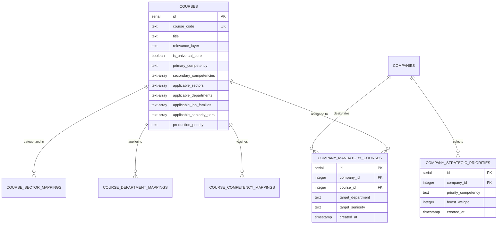

# ELEVIO SKILLS Course Metadata Schema Proposal

## 1. Architectural Context & Purpose

This document outlines the proposed database schema enhancements required to support the **Long-Term Course Catalogue (ELH-01 to ELH-136)**, the **5-Dimensional Taxonomy**, and the **Intelligent Learning Path Engine (ILPE)**.

> [!IMPORTANT]
> **Sprint 14.11 Architecture Boundary:**
> This document is an **architectural specification and migration proposal**.
> **No database schema mutations or live table alterations are executed during Sprint 14.11.**
> Implementation is scheduled for a dedicated migration sprint (Sprint 14.12+).

---

## 2. Analysis of Current Schema vs Requirements

### Current State (`lib/db/src/schema/courses.ts`)
The current `coursesTable` contains baseline fields:
- `courseCode`, `title`, `slug`, `description`, `level`
- `intendedRoles` (Text array `text[]`)
- `categoryId` (Integer foreign key)
- `learningObjectives` (Text array `text[]`)
- `isMandatory` (Global boolean)

### Metadata Gaps for Intelligent Learning Paths
1. **No Structured Sector Mapping:** Cannot distinguish hospitality vs. manufacturing vs. financial services courses.
2. **No Department Taxonomy:** `intendedRoles` contains freeform strings without canonical department foreign keys or enums.
3. **No Seniority / Decision Level:** `level` currently holds generic strings ("beginner", "applied") rather than separating pedagogical difficulty from managerial authority (`SEN_INDIVIDUAL`, `SEN_SUPERVISOR`, `SEN_MANAGER`, `SEN_EXECUTIVE`).
4. **No Competency Linkages:** Missing primary and secondary competency tags (`COMP_*`).
5. **No Tenant-Specific Priority Configuration:** `isMandatory` is currently a global flag on the course row rather than a tenant-scoped company assignment.

---

## 3. Proposed Schema Additions



---

## 4. Drizzle ORM Schema Specification

### 4.1. Proposed Extensions to `coursesTable` (`lib/db/src/schema/courses.ts`)

```typescript
import { pgTable, text, serial, integer, boolean, timestamp, jsonb } from "drizzle-orm/pg-core";

// Proposed additions to coursesTable:
export const coursesTableExtensions = {
  // Course Relevance Layer (Universal, Sector, Department, Role, Management, Advanced)
  relevanceLayer: text("relevance_layer").notNull().default("universal_core"),
  
  // Quick Universal Flag for Fast Path Filtering
  isUniversalCore: boolean("is_universal_core").notNull().default(false),
  
  // Primary Competency Code (e.g. COMP_ENERGY, COMP_WATER, COMP_GHG)
  primaryCompetency: text("primary_competency"),
  
  // Secondary Competencies
  secondaryCompetencies: text("secondary_competencies").array().notNull().default([]),
  
  // Canonical Sector Codes (e.g. SEC_HOSPITALITY, SEC_MANUFACTURING)
  applicableSectors: text("applicable_sectors").array().notNull().default([]),
  
  // Canonical Department Codes (e.g. DEP_FINANCE, DEP_FACILITIES, DEP_HR)
  applicableDepartments: text("applicable_departments").array().notNull().default([]),
  
  // Canonical Job Families (e.g. JF_FRONTLINE, JF_TECHNICAL, JF_PROFESSIONAL)
  applicableJobFamilies: text("applicable_job_families").array().notNull().default([]),
  
  // Applicable Seniority Tiers (e.g. SEN_INDIVIDUAL, SEN_SUPERVISOR, SEN_MANAGER, SEN_EXECUTIVE)
  applicableSeniorityTiers: text("applicable_seniority_tiers").array().notNull().default([]),
  
  // Production Priority Tier (P0, P1, P2, P3)
  productionPriority: text("production_priority").notNull().default("p0"),
  
  // Learning Path Purpose (Curriculum rationale)
  learningPathPurpose: text("learning_path_purpose"),
};
```

---

### 4.2. Proposed Tenant Company Configuration Tables (`lib/db/src/schema/companyLearningConfig.ts`)

```typescript
import { pgTable, text, serial, integer, timestamp, unique } from "drizzle-orm/pg-core";
import { companiesTable } from "./companies";
import { coursesTable } from "./courses";

/**
 * Tenant-scoped Strategic Focus Areas.
 * Allows Company Admins to select up to 2 strategic focus competencies (e.g. Water, Carbon),
 * which boosts course relevance scoring for their employees.
 */
export const companyStrategicPrioritiesTable = pgTable("company_strategic_priorities", {
  id: serial("id").primaryKey(),
  companyId: integer("company_id").notNull().references(() => companiesTable.id, { onDelete: "cascade" }),
  priorityCompetency: text("priority_competency").notNull(), // e.g. COMP_WATER, COMP_ENERGY
  boostWeight: integer("boost_weight").notNull().default(20),
  createdAt: timestamp("created_at", { withTimezone: true }).notNull().defaultNow(),
}, (t) => ({
  companyPriorityUnique: unique("company_priority_unique").on(t.companyId, t.priorityCompetency),
}));

/**
 * Tenant-scoped Mandatory Course Assignments.
 * Allows Company Admins to mandate specific courses across their organization
 * or target specific departments / seniority levels.
 */
export const companyMandatoryCoursesTable = pgTable("company_mandatory_courses", {
  id: serial("id").primaryKey(),
  companyId: integer("company_id").notNull().references(() => companiesTable.id, { onDelete: "cascade" }),
  courseId: integer("course_id").notNull().references(() => coursesTable.id, { onDelete: "cascade" }),
  targetDepartment: text("target_department"), // null = all departments
  targetSeniority: text("target_seniority"),   // null = all seniority levels
  deadlineDays: integer("deadline_days").default(30),
  createdAt: timestamp("created_at", { withTimezone: true }).notNull().defaultNow(),
}, (t) => ({
  companyCourseMandatoryUnique: unique("company_course_mandatory_unique").on(t.companyId, t.courseId, t.targetDepartment, t.targetSeniority),
}));
```

---

## 5. Migration Safety & Backward Compatibility Strategy

When this schema migration is executed in Sprint 14.12:
1. **Zero-Downtime Column Additions:** All new columns in `coursesTable` will be created with sensible defaults (`default([])`, `default(false)`, `default("universal_core")`) and nullable constraints where appropriate.
2. **Data Backfill for Existing 34 Courses:** An automated backfill migration will update `ELH-01` through `ELH-34` with their canonical taxonomy metadata as defined in `ELEVIO_LONG_TERM_CATALOGUE_ARCHITECTURE.md`.
3. **Preservation of Existing Relations:** Zero changes to `enrollmentsTable`, `certificatesTable`, `badgeDefinitionsTable`, or `learnerCommitmentsTable`.
4. **Tenant Isolation:** All newly created configuration tables explicitly enforce `company_id` foreign keys with cascade constraints and tenant-level indexes.
