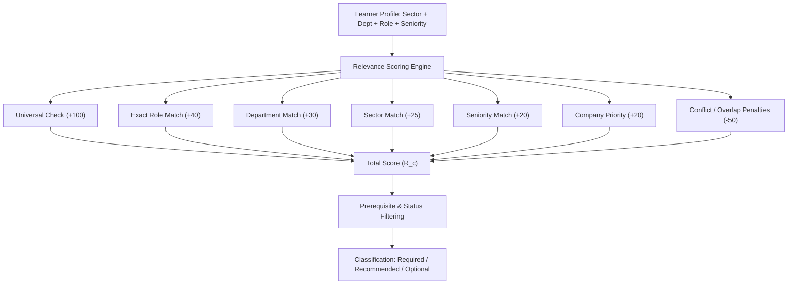
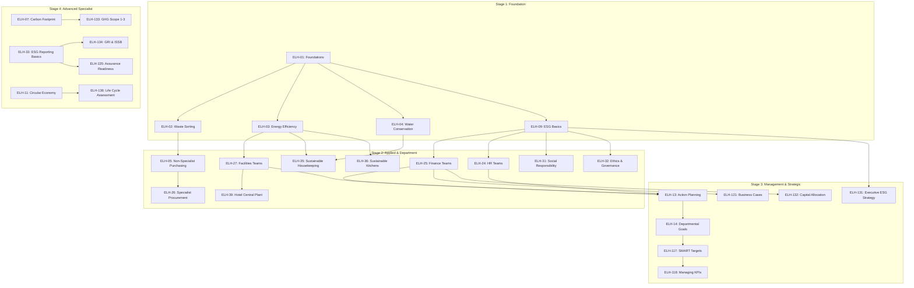
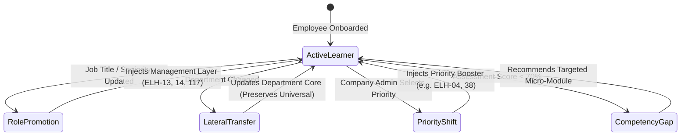

# ELEVIO SKILLS Intelligent Learning Path Engine Design

## 1. Executive Summary & Design Vision

The **ELEVIO Intelligent Learning Path Engine (ILPE)** is the algorithmic system responsible for generating highly relevant, role-tailored learning journeys for every employee.

Instead of presenting learners with an overwhelming generic library of 136 courses, the engine dynamically selects, orders, and balances courses based on:
1. **Industry Sector** (e.g. Hospitality vs. Manufacturing vs. Banking)
2. **Business Department** (e.g. Finance vs. Facilities vs. HR)
3. **Functional Job Family & Role** (e.g. Housekeeper vs. Maintenance Technician vs. Buyer)
4. **Seniority & Decision Authority** (e.g. Individual Contributor vs. Supervisor vs. General Manager)
5. **Demonstrated Competency Needs & Company Strategic Priorities**

---

## 2. Multi-Factor Course Relevance Scoring Model

For every active course $c$ in the catalogue, the engine calculates a **Relevance Score ($R_c$)** for learner $L$:

$$R_c = W_{\text{base}} + S_{\text{universal}} + S_{\text{role}} + S_{\text{dept}} + S_{\text{sector}} + S_{\text{seniority}} + S_{\text{company}} - P_{\text{conflict}} - P_{\text{overlap}}$$



### Scoring Weights & Calculation Rules

| Scoring Component | Condition / Trigger | Score Value | Purpose |
| :--- | :--- | :---: | :--- |
| **Universal Baseline ($S_{\text{universal}}$)** | Course is flagged `isUniversalCore = true` | **+100 pts** | Guarantees foundational workplace baseline for all learners. |
| **Exact Role Match ($S_{\text{role}}$)** | Course `intendedRoles` or `jobFamilies` exactly matches learner | **+40 pts** | Prioritizes task-specific standard operating procedures. |
| **Department Match ($S_{\text{dept}}$)** | Course `applicableDepartments` matches learner department | **+30 pts** | Assigns functional workflow courses (e.g. accounting, HR). |
| **Sector Match ($S_{\text{sector}}$)** | Course `applicableSectors` matches learner sector family | **+25 pts** | Contextualizes training to industry environmental impacts. |
| **Seniority Match ($S_{\text{seniority}}$)** | Course `level` and target seniority align with learner tier | **+20 pts** | Assigns supervisory/managerial content only to leaders. |
| **Company Priority ($S_{\text{company}}$)** | Course `primaryCompetency` matches company selected priority | **+20 pts** | Boosts employer-designated strategic focus areas (e.g. Water). |
| **Role Conflict Penalty ($P_{\text{conflict}}$)** | Course is designed for an unrelated technical role | **-50 pts** | Prevents assigning chemical/boiler courses to accountants. |
| **Seniority Mismatch Penalty** | Strategic/executive course matched to frontline operator | **-60 pts** | Protects frontline learners from irrelevant board oversight. |
| **Completed Course Action** | Course already passed with verified certificate | **Exclude / Advance** | Removes completed courses from current active pathway. |

---

## 3. Learning Path Tier Classification

Once scores are calculated, eligible courses are grouped into three distinct engagement tiers:

```
┌─────────────────────────────────────────────────────────────┐
│ 1. REQUIRED PATHWAY (Core Mandatory & Key Role Courses)    │
│    Threshold: R_c ≥ 115 (or designated by Company Admin)   │
├─────────────────────────────────────────────────────────────┤
│ 2. RECOMMENDED DEVELOPMENT (High-Value Sector/Skills)      │
│    Threshold: 85 ≤ R_c < 115                               │
├─────────────────────────────────────────────────────────────┤
│ 3. OPTIONAL ELECTIVES (Self-Directed Exploration)           │
│    Threshold: 60 ≤ R_c < 85                                │
└─────────────────────────────────────────────────────────────┘
```

| Tier Name | Definition & Business Function | Mandatory Status | Visibility in Learner UI |
| :--- | :--- | :---: | :--- |
| **Required** | Essential baseline compliance and primary role SOPs. | Mandatory | Displayed as the primary structured learning roadmap with progress bar. |
| **Recommended** | Cross-functional and secondary competency boosters. | Encouraged | Displayed under "Recommended for Your Role" upon completing core modules. |
| **Optional** | Broader career development and general sustainability topics. | Elective | Accessible in the open catalogue search for self-paced enrichment. |

---

## 4. Path Length Guardrails & Cognitive Load Limits

To avoid overwhelming employees with excessive course assignments, the engine enforces strict **Active Path Limits**:

| Learner Persona / Seniority Tier | Maximum Required Courses | Estimated Completion Hours | Recommended Distribution |
| :--- | :---: | :---: | :--- |
| **Frontline Operational Staff** | **4 – 6 courses** | $1.5\text{--}2.5\text{ hours}$ | 2 Universal + 2 Sector/Role + 1 Applied + Capstone |
| **Administrative & Office Staff** | **5 – 7 courses** | $2.0\text{--}3.0\text{ hours}$ | 3 Universal + 2 Dept/Office + 1 Applied + Capstone |
| **Technical & Specialist Ops** | **6 – 8 courses** | $2.5\text{--}4.0\text{ hours}$ | 2 Universal + 3 Technical SOPs + 2 Compliance + Capstone |
| **Supervisors & Line Leads** | **7 – 9 courses** | $3.0\text{--}4.5\text{ hours}$ | 2 Universal + 2 Role/Dept + 3 Management + Capstone |
| **Department Managers** | **8 – 10 courses** | $3.5\text{--}5.0\text{ hours}$ | 2 Universal + 3 Dept Core + 3 Management/KPIs + Capstone |
| **Executive & Senior Leadership** | **5 – 7 courses** | $2.5\text{--}3.5\text{ hours}$ | 1 Foundational + 4 Strategic Governance/Capital + Capstone |
| **ESG Coordinators & Specialists** | **10 – 14 courses** | $5.0\text{--}7.5\text{ hours}$ | Multi-stage professional mastery pathway |

---

## 5. Prerequisite Graph & Sequencing Engine

The learning engine sequences courses logically to ensure learners master foundational concepts before encountering advanced operational workflows.



### Prerequisite Exemption & Fast-Track Rules
1. **Prior Completion Credit:** Any course completed in a previous role remains permanently certified and satisfies downstream prerequisites.
2. **Diagnostic Placement (Future Capability):** A learner demonstrating $\ge 90\%$ on an entry diagnostic assessment can bypass introductory foundation modules directly to role-specific courses.
3. **Manager Fast-Track:** Managers are not forced through entry-level frontline cleaning or driving courses; their prerequisites link directly through `ELH-01`, `ELH-09`, and functional department courses.

---

## 6. Dynamic Learner Adaptation Logic

Learning paths are not static snapshots. The engine dynamically recalculates journeys upon life-cycle trigger events:



### Event Handler Rules
1. **Promotion Event (e.g. Operator &rarr; Supervisor):**
   - Retains completed operational modules.
   - Automatically injects the Management & Leadership layer (`ELH-13`, `ELH-14`, `ELH-117`, `ELH-119`).
2. **Lateral Transfer (e.g. Front Office &rarr; HR):**
   - Preserves Universal Core and sector courses.
   - Retires old department courses and populates new functional modules (`ELH-24`, `ELH-31`).
3. **Company Priority Injection (e.g. "Water Conservation"):**
   - Adds $+20\text{ pts}$ to all water-related courses, elevating relevant role-specific water modules into the Recommended/Required tier.

---

## 7. Company Admin Priority & Mandatory Overrides

Company Administrators hold the authority to tailor training without breaking role relevance:

1. **Strategic Priority Boosters:** An admin selects up to 2 Strategic Focus Areas (e.g. *Waste Reduction* and *Energy Efficiency*). The engine automatically boosts related courses for all employees.
2. **Tenant-Level Mandatory Course Lock:** An admin can designate any specific course as **Mandatory Company Training** (e.g. `ELH-32: Ethics, Governance & Responsible Business`). The engine forces the course into the Required tier across all tenant accounts regardless of algorithmic score.
3. **Tenant Isolation Guarantee:** Company priority selections and mandatory rules apply strictly within that company's tenant boundary and never leak across organizations.

---

## 8. Path Differentiation Mathematical Formula

To ensure ELEVIO never becomes a generic catalogue where all employees receive identical training, the platform measures **Pairwise Path Differentiation ($D_{A,B}$)** between two learner paths $P_A$ and $P_B$:

$$D_{A,B} = 1 - \frac{|P_A \cap P_B|}{|P_A \cup P_B|}$$

### Differentiation Benchmarks & Validation Thresholds

| Comparison Pair | Target Overlap ($|P_A \cap P_B|$) | Minimum Required Differentiation ($D_{A,B}$) | Design Rationale |
| :--- | :---: | :---: | :--- |
| **Different Sectors & Roles**<br>*(e.g. Housekeeper vs. Bank Credit Analyst)* | $\le 2\text{ courses}$<br>*(Universal Core only)* | **$\ge 0.80$ ($80\%$ Distinct)** | Zero shared functional courses; maximum tailoring. |
| **Same Sector, Different Departments**<br>*(e.g. Hotel Chef vs. Hotel Accountant)* | $2\text{--}3\text{ courses}$<br>*(Universal + Sector Core)* | **$\ge 0.65$ ($65\%$ Distinct)** | Shares hotel context, but culinary vs financial SOPs diverge. |
| **Same Department, Vertical Seniority**<br>*(e.g. HR Officer vs. HR Manager)* | $4\text{--}6\text{ courses}$<br>*(Universal + Dept Core)* | **$\ge 0.40$ ($40\%$ Distinct)** | Shares HR knowledge; manager receives additional leadership/KPI modules. |

Any generated catalogue that fails these differentiation thresholds is rejected by automated validation tests.
