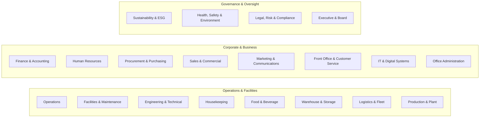
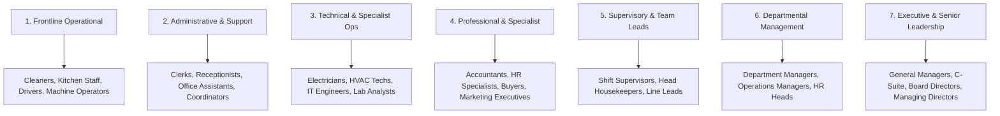
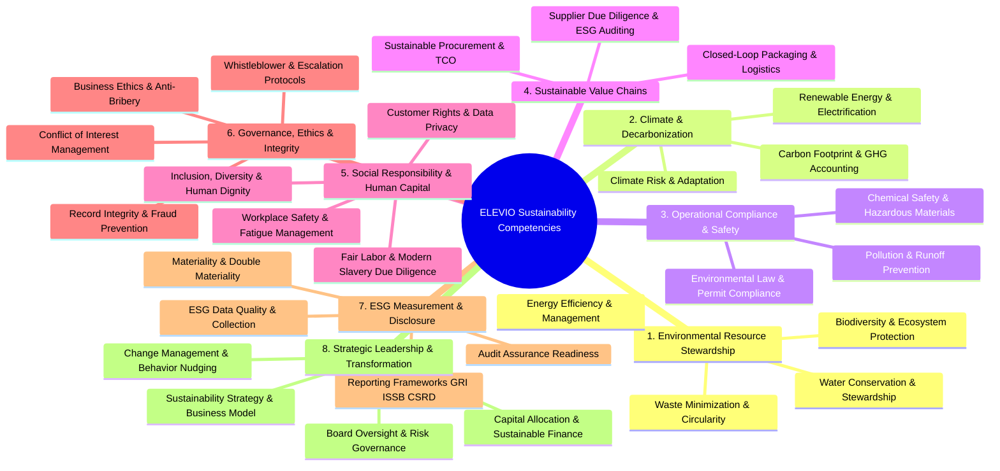

# ELEVIO SKILLS Taxonomy & Classification Architecture

## 1. Executive Overview & Purpose

The ELEVIO SKILLS platform is designed to provide high-impact, tailored sustainability training for diverse commercial, industrial, and service organisations.

To ensure that two employees in different sectors, departments, or seniority tiers receive meaningfully distinct and relevant learning experiences without creating an unmanageable matrix of fragmented tags, ELEVIO utilizes a standardized **5-Dimensional Taxonomy Architecture**:

$$\text{Learner Context} = \text{Sector Family} + \text{Department} + \text{Job Family} + \text{Seniority Tier} + \text{Competency Need}$$

This document defines the canonical classifications, aliases, governance rules, and mapping relationships that power the **Intelligent Learning Path Engine**.

---

## 2. Six Course Relevance Layers

Every course in the ELEVIO SKILLS catalogue belongs to one or more primary relevance layers:

```
┌─────────────────────────────────────────────────────────────┐
│ F. ADVANCED / ESG PROFESSIONAL SPECIALIST                  │
│    (GHG Accounting, Double Materiality, CSRD/GRI/ISSB)      │
├─────────────────────────────────────────────────────────────┤
│ E. MANAGEMENT & STRATEGIC LEADERSHIP                        │
│    (Leading Teams, Capital Allocation, Risk & Board)        │
├─────────────────────────────────────────────────────────────┤
│ D. ROLE / OPERATIONAL SPECIALIST                            │
│    (Housekeeping, Plant Maintenance, Fleet Drivers, Kitchen)│
├─────────────────────────────────────────────────────────────┤
│ C. DEPARTMENT CORE                                          │
│    (HR, Finance, Procurement, Facilities, Sales/Marketing)  │
├─────────────────────────────────────────────────────────────┤
│ B. SECTOR CORE                                              │
│    (Hospitality, Manufacturing, Property, Banking, Retail) │
├─────────────────────────────────────────────────────────────┤
│ A. UNIVERSAL CORE                                           │
│    (Foundations, Waste, Energy, Water, Basic ESG, Everyday) │
└─────────────────────────────────────────────────────────────┘
```

| Layer Code | Layer Name | Target Learner Audience | Pedagogical Purpose |
| :--- | :--- | :--- | :--- |
| **A** | **Universal Core** | All employees across all sectors and roles. | Establishes shared environmental vocabulary, basic resource habits, and everyday ESG awareness. |
| **B** | **Sector Core** | Employees within a specific industry vertical. | Contextualizes sustainability around industry-specific environmental footprints and regulations. |
| **C** | **Department Core** | Employees within a specific business function. | Integrates sustainability into functional workflows (e.g. accounting, onboarding, purchasing). |
| **D** | **Role Specialist** | Frontline and technical employees with task-specific duties. | Provides actionable standard operating procedures (SOPs), safety boundaries, and equipment practices. |
| **E** | **Management & Leadership** | Team leads, supervisors, department heads, and executives. | Equips decision-makers to manage budgets, set targets, lead behavior change, and oversee governance. |
| **F** | **Advanced / ESG Professional** | Sustainability leads, ESG working groups, compliance officers. | Delivers rigorous technical methodologies for GHG accounting, reporting standards, and auditing. |

---

## 3. Canonical Sector Taxonomy

To balance the domestic commercial landscape in Mauritius with regional and international scalability, ELEVIO establishes **10 Canonical Sector Families** encompassing **18 Specific Industry Sectors**.

```mermaid
graph TD
  SF1["1. Hospitality & Tourism"] --> S1["Resorts, Hotels & Accommodations"]
  SF1 --> S2["Food & Beverage Services / Restaurants"]
  SF1 --> S3["Travel, Tour Operators & Leisure"]

  SF2["2. Property & Real Estate"] --> S4["Commercial Property & Facilities Mgmt"]
  SF2 --> S5["Building Construction & Civil Engineering"]

  SF3["3. Manufacturing & Industry"] --> S6["Textile, Apparel & Garment Manufacturing"]
  SF3 --> S7["General Industrial, Food & Beverage Processing"]

  SF4["4. Financial Services"] --> S8["Commercial & Retail Banking"]
  SF4 --> S9["Insurance & Asset Management"]

  SF5["5. Retail & Consumer Goods"] --> S10["Supermarkets, Retail & Consumer Goods"]
  SF5 --> S11["FMCG Distribution & Wholesaling"]

  SF6["6. Logistics & Transportation"] --> S12["Warehousing, Freight & Port Logistics"]
  SF6 --> S13["Corporate Fleet & Road Transportation"]

  SF7["7. Professional Services & ICT"] --> S14["Corporate Offices & Professional Services"]
  SF7 --> S15["Information Technology, Software & BPO"]

  SF8["8. Agriculture & Blue Economy"] --> S16["Cane, Crops, Agribusiness & Food Production"]
  SF8 --> S17["Marine, Aquaculture & Coastal Operations"]

  SF9["9. Healthcare & Life Sciences"] --> S18["Hospitals, Clinics & Medical Services"]
  SF10["10. Education & Public Sector"] --> S19["Schools, Universities & Public Entities"]
```



### Canonical Sector Definitions & Aliases

| Canonical Sector Family | Canonical Sector Code | Sector Description | Industry Aliases (Mapped Automatically) |
| :--- | :--- | :--- | :--- |
| **Hospitality & Tourism** | `SEC_HOSPITALITY` | Hotels, resorts, guest houses, tour operators, eco-tourism, catering. | `Hotels`, `Resorts`, `Tourism`, `Lodging`, `Restaurants`, `Catering`, `F&B Operations`, `Hospitality Group` |
| **Property & Facilities** | `SEC_PROPERTY` | Commercial office buildings, shopping malls, residential estates, FM services. | `Real Estate`, `Facilities Management`, `Property Management`, `Building Services`, `Estate Management` |
| **Construction & Engineering** | `SEC_CONSTRUCTION` | Civil engineering, commercial building construction, infrastructure projects. | `Building Contractors`, `Civil Works`, `Architecture & Engineering`, `Construction Services` |
| **Manufacturing & Textiles** | `SEC_MANUFACTURING` | Textile mills, garment factories, food processing, industrial manufacturing. | `Textiles`, `Apparel`, `Garment Factories`, `Food Processing`, `Industrial Production`, `Packaging Plants` |
| **Financial Services** | `SEC_FINANCE` | Commercial banks, insurance companies, asset managers, offshore fintech. | `Banking`, `Commercial Banking`, `Insurance`, `Asset Management`, `Wealth Management`, `Fintech`, `Offshore Services` |
| **Retail & Distribution** | `SEC_RETAIL` | Supermarket chains, shopping centers, retail stores, consumer goods distributors. | `Retail Chains`, `Supermarkets`, `FMCG Retail`, `Department Stores`, `Commercial Stores` |
| **Logistics & Transport** | `SEC_LOGISTICS` | Freight forwarders, port logistics, supply chain depots, corporate delivery fleets. | `Warehousing`, `Freight Forwarding`, `Supply Chain Logistics`, `Fleet Operations`, `Courier & Delivery` |
| **Professional Services & ICT**| `SEC_PROF_SERVICES` | BPO centers, IT software firms, management consultancies, legal and accounting firms. | `BPO`, `Tech Companies`, `Software Developers`, `Legal Firms`, `Consulting`, `Call Centers` |
| **Agriculture & Agribusiness** | `SEC_AGRICULTURE` | Sugar cane estates, tea plantations, hydroponics, livestock, aquaculture. | `Agribusiness`, `Farming`, `Sugar Industry`, `Aquaculture`, `Food Cultivation`, `Plantations` |
| **Healthcare & Social Care** | `SEC_HEALTHCARE` | Private hospitals, medical clinics, diagnostic laboratories, elder care. | `Clinics`, `Hospitals`, `Medical Centers`, `Diagnostic Labs`, `Pharmaceuticals` |

---

## 4. Canonical Department Taxonomy

ELEVIO standardizes internal corporate structures into **20 Canonical Departments** equipped with comprehensive alias dictionaries to absorb varied client terminology.



### Canonical Department Dictionary & Alias Mapping

| Canonical Department Code | Canonical Department Name | Typical Business Responsibilities | Ingested Aliases |
| :--- | :--- | :--- | :--- |
| `DEP_OPERATIONS` | **Operations** | General operational delivery, service execution, workflow coordination. | `Ops`, `Operations Team`, `Service Delivery`, `Branch Operations` |
| `DEP_FACILITIES` | **Facilities & Property** | Building operations, tenant services, HVAC, plumbing, space management. | `Facilities`, `Building Management`, `FM`, `Property Operations`, `Estate Team` |
| `DEP_ENGINEERING` | **Engineering & Maintenance** | Plant room maintenance, machinery servicing, electrical systems, repairs. | `Maintenance`, `Technical Services`, `Engineering Team`, `Plant Engineering` |
| `DEP_HOUSEKEEPING` | **Housekeeping** | Room cleaning, linen care, public area sanitization, amenity restocking. | `Accommodations`, `Guest Rooms`, `Cleaning Services`, `Linen & Laundry` |
| `DEP_FOOD_BEVERAGE` | **Food & Beverage** | Kitchen preparation, stewarding, restaurant service, banquet operations. | `F&B`, `Kitchen`, `Culinary`, `Stewarding`, `Restaurant & Bar`, `Catering` |
| `DEP_FINANCE` | **Finance & Accounting** | Budgeting, accounts payable/receivable, financial reporting, payroll. | `Accounts`, `Financial Control`, `Treasury`, `Bookkeeping`, `Billing` |
| `DEP_HR` | **Human Resources** | Recruitment, onboarding, employee relations, learning & development. | `People & Culture`, `Human Capital`, `Personnel`, `Talent Acquisition`, `L&D` |
| `DEP_PROCUREMENT` | **Procurement & Purchasing** | Supplier sourcing, tender evaluations, purchasing requisitions, vendor mgmt. | `Purchasing`, `Sourcing`, `Supply Chain`, `Buying Team`, `Vendor Management` |
| `DEP_SALES` | **Sales & Commercial** | Business development, client accounts, commercial tenders, contract closing. | `Commercial`, `Business Development`, `B2B Sales`, `Account Executives` |
| `DEP_MARKETING` | **Marketing & Communications** | Brand strategy, social media, customer campaigns, PR, graphic design. | `Brand`, `Communications`, `PR`, `Digital Marketing`, `Creative Services` |
| `DEP_CUSTOMER_SERVICE`| **Customer Service & Front Office** | Reception, guest relations, concierge, client contact center, helpdesk. | `Front Desk`, `Reception`, `Guest Relations`, `Call Center`, `Client Services` |
| `DEP_IT` | **IT & Digital Systems** | Hardware infrastructure, software development, data security, networking. | `Technology`, `Digital`, `Information Systems`, `Software Engineering`, `IT Ops` |
| `DEP_ADMIN` | **Office Administration** | Reception, office supplies, mail, secretarial support, executive assistance. | `Admin`, `General Office`, `Business Support`, `Secretarial`, `Office Services` |
| `DEP_LOGISTICS` | **Logistics & Fleet** | Transport scheduling, vehicle maintenance, distribution routing, dispatch. | `Transport`, `Fleet Management`, `Distribution`, `Freight Dispatch` |
| `DEP_WAREHOUSE` | **Warehouse & Inventory** | Goods receiving, pallet storage, inventory stock control, material handling. | `Stores`, `Inventory Control`, `Stockroom`, `Material Handling`, `Depot` |
| `DEP_PRODUCTION` | **Production & Manufacturing** | Assembly line operations, machinery operation, batch processing, packaging. | `Factory Floor`, `Manufacturing Ops`, `Assembly`, `Plant Operations` |
| `DEP_HSE` | **Health, Safety & Environment** | Workplace safety audits, PPE compliance, spill response, hazard logging. | `OH&S`, `Safety`, `EHS`, `Risk & Safety`, `Occupational Health` |
| `DEP_LEGAL_COMPLIANCE`| **Legal, Risk & Compliance** | Statutory compliance, contract governance, internal audit, risk management. | `Legal`, `Compliance`, `Risk Management`, `Internal Audit`, `Regulatory Affairs` |
| `DEP_SUSTAINABILITY` | **Sustainability & ESG** | ESG reporting, carbon accounting, sustainability projects, green committees. | `ESG`, `Corporate Responsibility`, `CSR`, `Environmental Team`, `Green Team` |
| `DEP_EXECUTIVE` | **Executive Leadership** | Board governance, strategic vision, enterprise capital allocation, P&L. | `C-Suite`, `Executive Committee`, `Managing Directors`, `Board of Directors` |

---

## 5. Job Family Taxonomy

To avoid attempting to hard-code thousands of idiosyncratic job titles, ELEVIO classifies roles into **7 Functional Job Families**:



### Job Family Characteristics

| Job Family Code | Family Name | Primary Operational Focus | Decision Authority |
| :--- | :--- | :--- | :--- |
| `JF_FRONTLINE` | **Frontline Operational** | Physical task execution, equipment operation, manual workflows. | Direct task execution; must follow SOPs and report anomalies. |
| `JF_ADMIN` | **Administrative & Office Support** | Document processing, scheduling, communication, data entry. | Workflow organization; manages office supplies and internal requests. |
| `JF_TECHNICAL` | **Technical & Specialist Ops** | Equipment diagnostics, physical repairs, IT networks, maintenance. | Technical troubleshooting; executes licensed repairs and safety tests. |
| `JF_PROFESSIONAL`| **Professional & Specialist** | Commercial analysis, procurement, accounting, marketing copy, HR. | Analytical decision-making; prepares business cases and vendor specs. |
| `JF_SUPERVISOR` | **Supervisory & Team Lead** | Daily shift coordination, attendance, task assignment, coaching. | Shift oversight; first-line escalation and quality verification. |
| `JF_MANAGER` | **Departmental Management** | Budget control, performance targets, process design, vendor approval. | Departmental P&L; approves capital proposals and operational policies. |
| `JF_EXECUTIVE` | **Executive & Senior Leadership** | Strategic direction, enterprise governance, risk, capital allocation. | Enterprise oversight; approves corporate ESG commitments and disclosures. |

---

## 6. Seniority & Responsibility Taxonomy

Seniority defines the learner's decision authority and cognitive scope, distinguishing functional specialists from operational managers.

| Seniority Tier Code | Seniority Name | Scope of Responsibility | Typical Titles |
| :--- | :--- | :--- | :--- |
| `SEN_INDIVIDUAL` | **Individual Contributor** | Personal task execution and individual compliance. | Assistant, Officer, Operator, Associate, Technician, Analyst |
| `SEN_SUPERVISOR` | **Supervisor / Team Lead** | First-line operational oversight of $3\text{--}15$ team members. | Team Lead, Shift Supervisor, Head Housekeeper, Section Head |
| `SEN_MANAGER` | **Department Manager** | Full department operations, budget management, and staffing. | Department Manager, Operations Manager, Financial Controller |
| `SEN_HEAD` | **Department Head / Director**| Multi-department or divisional strategic oversight. | Director of Operations, Head of HR, Director of Engineering |
| `SEN_EXECUTIVE` | **C-Suite / Executive Leader**| Enterprise-wide legal, strategic, and financial responsibility. | CEO, Managing Director, CFO, COO, General Manager, Board Member |

> [!NOTE]
> **The Specialist Dimension:** A Senior Sustainability Analyst or Chief Engineer holds high functional complexity (`JF_PROFESSIONAL` / `JF_TECHNICAL`) with `SEN_INDIVIDUAL` or `SEN_SUPERVISOR` managerial scope. The taxonomy cleanly separates technical depth from people/budget authority.

---

## 7. Sustainability Competency Framework

ELEVIO structures all educational outcomes across **12 Core Sustainability Competency Domains** divided into **32 Specific Competencies**:



### Competency Coding & Definitions

| Competency Code | Competency Title | Domain | Key Skills & Outcomes |
| :--- | :--- | :--- | :--- |
| `COMP_ENERGY` | Energy Efficiency & Management | Resource Stewardship | 24°C benchmarks, idle power reduction, HVAC optimization, sub-metering. |
| `COMP_WATER` | Water Conservation & Stewardship | Resource Stewardship | Leak isolation, flow regulation, washdown efficiency, cooling tower monitoring. |
| `COMP_CIRCULARITY` | Waste Minimization & Circularity | Resource Stewardship | Waste segregation, 9-step circular hierarchy, reuse, e-waste data wiping. |
| `COMP_BIODIVERSITY` | Biodiversity & Ecosystem Protection | Resource Stewardship | Invasive species, coral lagoon runoff, bird-friendly lighting, Pause-Protect. |
| `COMP_GHG` | Carbon & GHG Accounting | Climate & Decarbonization | Scope 1–3 calculation, emission factors, refrigerant logs, reduction plans. |
| `COMP_CLIMATE_RISK` | Climate Risk & Adaptation | Climate & Decarbonization | Physical flood/cyclone vulnerability, business continuity, transition risks. |
| `COMP_COMPLIANCE` | Environmental Legal Compliance | Operational Compliance | EPA Mauritius, permit conditions, STOP-CHECK-CONTROL, spill kits. |
| `COMP_PROCUREMENT` | Sustainable Procurement & Sourcing | Value Chains | Whole-life value (TCO), supplier green claims audit, ISO 20400 standards. |
| `COMP_SUPPLY_CHAIN` | Supply Chain Due Diligence | Value Chains | Vendor ESG audits, modern slavery indicators, ethical contractor clauses. |
| `COMP_SOCIAL` | Social Responsibility & Labor Standards| Human Capital | Worker fatigue, psychological safety, fair wages, contractor amenities. |
| `COMP_GOVERNANCE` | Ethics, Governance & Anti-Bribery | Governance & Ethics | Gift registers, conflict of interest disclosure, backdating prevention, whistleblowing. |
| `COMP_ESG_DATA` | ESG Data Collection & Evidence | ESG Measurement | Primary meter logs, SOURCE framework, unit validation, zero vs missing data. |
| `COMP_ESG_REPORTING`| ESG Disclosure & Frameworks | ESG Measurement | GRI, ISSB (IFRS S1/S2), double materiality, boundary consolidation, assurance. |
| `COMP_LEADERSHIP` | Sustainability Leadership & Change | Strategic Leadership | Team coaching, KPI setting, green team facilitation, obstacle removal. |
| `COMP_STRATEGY` | Strategic ESG & Capital Allocation | Strategic Leadership | Sustainable finance, ROI/payback modeling, brand reputation, board oversight. |

---

## 8. Taxonomy Governance & Validation Rules

To prevent taxonomy entropy, the platform enforces strict data validation:

1. **Immutable Canonical Codes:** Course seeders and learner profiles must reference canonical codes (`SEC_*`, `DEP_*`, `JF_*`, `SEN_*`, `COMP_*`).
2. **Dynamic Alias Resolution:** Ingested company data (e.g. employee CSV imports) passes through the alias translation dictionary before path calculation.
3. **Multi-Tagging Boundaries:**
   - Universal courses: `isUniversalCore = true` (matches all).
   - Sector courses: Mapped to $1\text{--}3$ specific sectors.
   - Department courses: Mapped to $1\text{--}2$ primary departments.
   - Role courses: Require exact `Job Family` + `Department` match.
   - Management courses: Require `SEN_SUPERVISOR`, `SEN_MANAGER`, `SEN_HEAD`, or `SEN_EXECUTIVE`.
